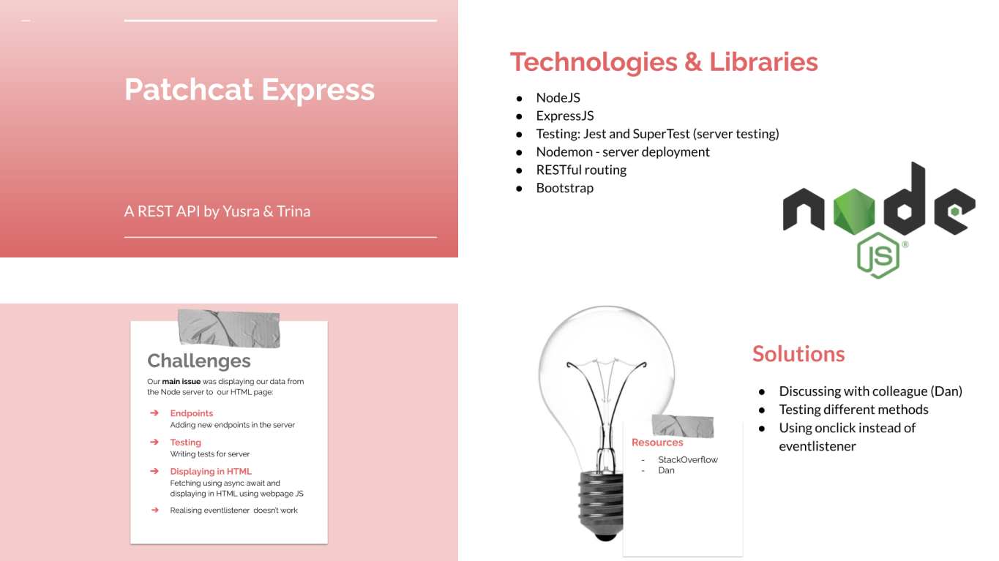

# Patchcat Express - Our First ExpressJS API
## Brief

Start work on your own API!

You can choose what your API does.
You can choose what you use to create it eg. http module/express/alternative framework.
Write some tests using jest and supertest and check your coverage with jest, aiming for minimum 60-80% coverage.
Consider RESTful routing.
As a stretch goal, try and implement all four parts of CRUD functionality (Create, Read, Update, Delete)
Use our Presentation Tips to help prepare a 5 minute presentation of your new API including:
* technologies / libraries used
* challenges and solutions
* a live demonstration of your API's functionality: you could demonstrate using curl, Postman, a custom client or a combination!
* There will be open Q&A after each presentation

## Team Discussion
We decided to build upon the tutorial work that we did using the cats array, replacing the names and ages with our own pets. 
Our goal was to fetch the cats array from the API and display the results on our webpage. 
We decided to pair-code on this to enhance our learning experience.

## Final
### Patchcat Express Final Look

### Patchcat Express Presentation
[Link to PatchCat Express Presentation](https://docs.google.com/presentation/d/16G4xzuX6k1btGC5K-7NjUtK6CMyo-8niEMFFl6gMDvE/edit?usp=sharing "Google Slides of Patchcat Express")

## Reflections
- We were asked whether there was functionality to show all cats, but we did not add this. We can consider adding this in the future
- We need to write more tests for both the server and the webpage
- Need to add error handling functionality to the API
