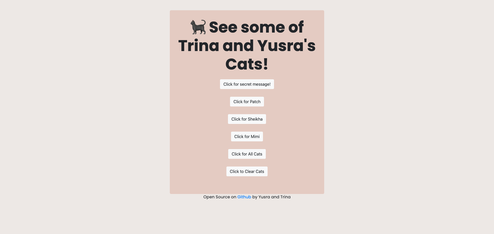

# Patchcat Express - Our First ExpressJS API
## Brief
Working in pairs:

Start work on your own API!

You can choose what your API does
You can choose what you use to create it eg. http module/express/alternative framework.
Write some tests using jest and supertest and check your coverage with jest, aiming for minimum 60-80% coverage.
Consider RESTful routing
As a stretch goal, try and implement all four parts of CRUD functionality (Create, Read, Update, Delete)
Use our Presentation Tips to help prepare a 5 minute presentation of your new API including:

technologies / libraries used
challenges and solutions
a live demonstration of your API's functionality: you could demonstrate using curl, Postman, a custom client or a combination!
There will be open Q&A after each presentation

## Final

## Reflections
- We were asked whether there was functionality to show all cats, but we did not add this. We can consider adding this in the future
- We need to write more tests 
